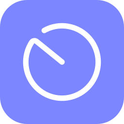
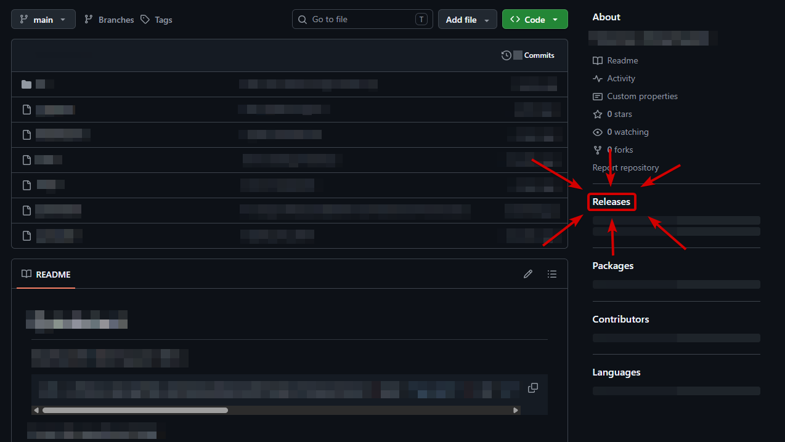

> [!CAUTION]
> **Looking for the Vencord installer? This is not it.** SolRadar Helper is an unofficial tool that only installs the SolRadar plugin. To install Vencord itself, use the official installer at <https://vencord.dev/download/>.

<div align="center">



# SolRadar Helper

Install, update and remove the SolRadar Vencord plugin without opening a terminal.

[](#requirements)
[](LICENSE)
[](https://bun.sh)
[](https://gitlab.com/masutty/solradar)


</div>

## About

This is **not** an official Vencord installer, and it is not affiliated with the Vencord project in any way. It is a convenience tool. It installs Vencord from source together with the [SolRadar](https://gitlab.com/masutty/solradar) plugin, because the people who use this plugin would otherwise need to open a terminal. That is all.

## Getting the Helper

The app is published in the **Releases** section of this repository, in the sidebar on the right of the repository page. Open the latest release, get `SolRadarHelper.exe` there and run it. The Helper clones, builds and injects everything for you.

<p align="center"></p>

If you prefer, you can build it yourself from this source code. See [Build it yourself](#build-it-yourself).

> [!NOTE]
> **The app is not code-signed.** A code-signing certificate is too expensive for a personal project, so Windows SmartScreen may show a warning the first time you open it. All of the source code is in this repository, and you can build the exe yourself if you prefer.

## What it does

- Checks for Git and Node.js. If one is missing, it offers to install it with winget, or shows manual steps.
- Keeps its own copy of the Vencord source in `%LOCALAPPDATA%\SolRadarHelper`.
- Adds the SolRadar plugin and builds Vencord.
- Patches Discord with Vencord's own installer.
- Keeps the last working build if an update fails.
- Reopens Discord when it is done.

## Requirements

- Windows 10 or 11 with WebView2 (preinstalled on Windows 11).
- Discord installed.
- Git and Node.js. The Helper installs them if they are missing.

## Usage

- **Install**: sets up Vencord with SolRadar.
- **Update**: updates SolRadar and Vencord. The button shows **Reinstall** when everything is up to date.
- **Uninstall**: in the **⋯** menu.

> [!WARNING]
> **Uninstall removes Vencord from Discord completely**, not only SolRadar. To go back to regular Vencord, use the [official Vencord installer](https://vencord.dev/download/).

> [!TIP]
> Something went wrong? Open **⋯** and choose **Generate debug report**, then send the file when asked. Personal information is hidden by default: your Windows user name, computer name, email addresses and token-like strings.

### Troubleshooting tools

In **⋯ → Troubleshooting tools** you can rebuild SolRadar from the files already downloaded, re-apply it to Discord (for example after a Discord update), show the installed and latest versions, and open the installation folder.

### Test scenarios

In **⋯ → Test scenarios** you can simulate situations such as a missing Git, an old Node.js or an available update. They only change what the window shows. Nothing on your computer changes, and restarting the Helper clears them.

## Privacy

- It never reads your Discord account or token.
- It has no telemetry.
- It only connects to the internet to download and check for updates: GitHub (Vencord, Vencord's installer, Helper updates), GitLab (SolRadar), the npm registry (Vencord's packages) and, only when you click "Install automatically" for Git or Node.js, Windows Package Manager (winget) and the official download sites of those tools.

## FAQ

**Does this replace my Vencord?**
It sets up its own Vencord build with SolRadar and patches Discord with it. Uninstall removes that patch completely. To go back to regular Vencord, use the [official installer](https://vencord.dev/download/).

**Where are the files stored?**
In `%LOCALAPPDATA%\SolRadarHelper`: the Vencord source copy and the logs.

**Why does it need Git and Node.js?**
Vencord supports custom plugins only through a source build. Git downloads the source, and Node.js builds it.

**Is it safe?**
The source code is in this repository, and you can review it or build the exe yourself. If you prefer, use the manual method below.

## Don't trust the installer?

Do it by hand. Follow the [custom plugins guide](https://docs.vencord.dev/installing/custom-plugins/). In `src/userplugins`, run:

```sh
git clone https://gitlab.com/masutty/solradar
```

Then build and inject as the guide describes.

## Build it yourself

You need [Bun](https://bun.sh). The end user needs nothing. The released exe is built by this same code.

```sh
bun install
bun run build   # outputs dist/SolRadarHelper.exe
```

Other scripts: `bun run dev` (run from source), `bun test`, `bun run typecheck`.

## Credits

- [Vencord](https://github.com/Vendicated/Vencord): the project this builds on.
- [SolRadar](https://gitlab.com/masutty/solradar): the plugin this Helper installs.
- Vencord Installer: used by Vencord's own inject script to patch Discord.
- Radar icon: "Radar" from the Solar Line Duotone Icons collection by [Solar Icons](https://www.svgrepo.com/collection/solar-line-duotone-icons/), via [SVG Repo](https://www.svgrepo.com), licensed under [CC BY 4.0](https://creativecommons.org/licenses/by/4.0/). Recolored and placed on a colored tile for the app icon.
- Brand icons (Git, Node.js, Discord, Vencord): [Simple Icons](https://simpleicons.org), CC0.
- [Bun](https://bun.sh) and [webview-bun](https://github.com/tr1ckydev/webview-bun).

Trademarks belong to their owners and are used only to identify software.

---

This project was largely created with the help of AI (Claude), and reviewed by me, with manual adjustments where needed. Made with ❤️ + 🤖 by masutty.
